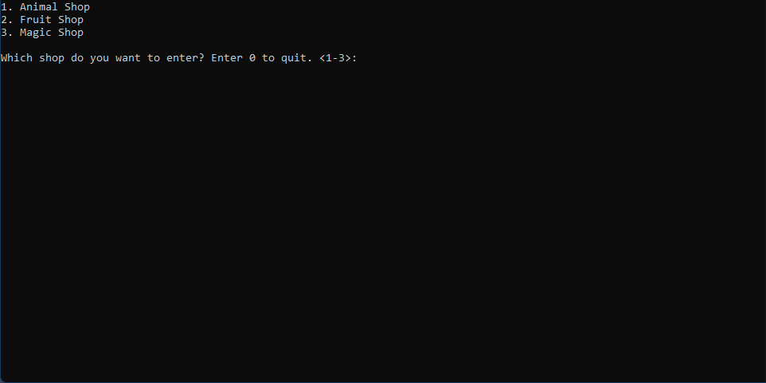
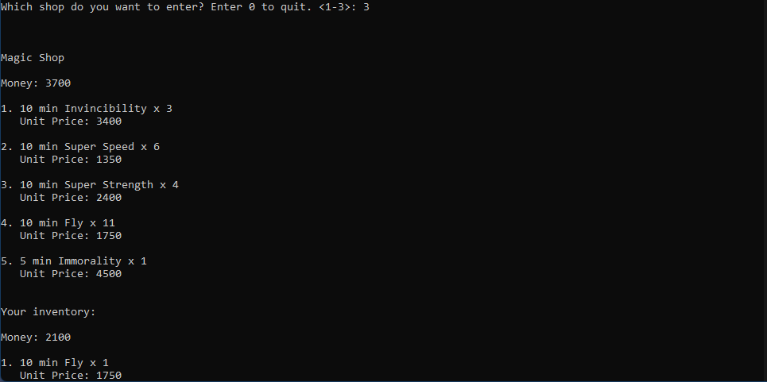
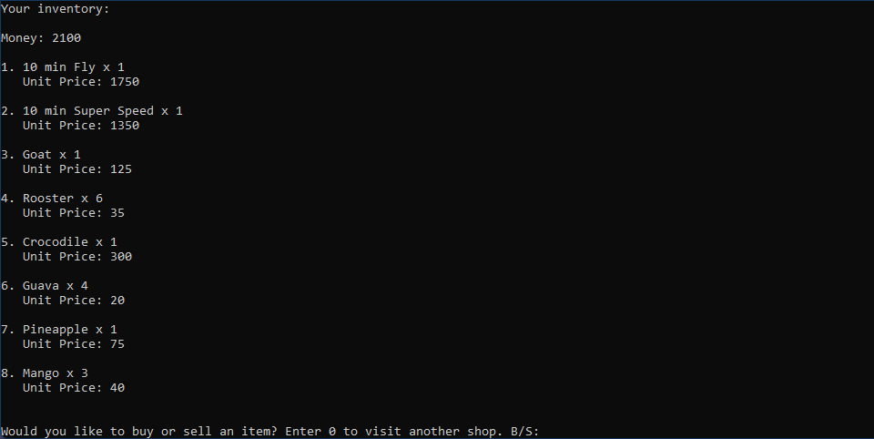

# Shops-cpp
A C++ basic OOP practice project as shown in this [video](https://www.youtube.com/watch?v=1MhwYEz0hrk&list=PLSPw4ASQYyynKPY0I-QFHK0iJTjnvNUys&index=23&ab_channel=MakingGamesWithBen).

I took the idea and wrote all the codes myself. I also made the data persistance by making a file-saving functionality.

Here are some screenshots - 

